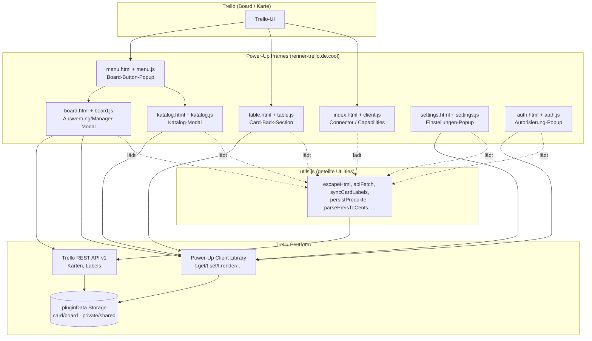
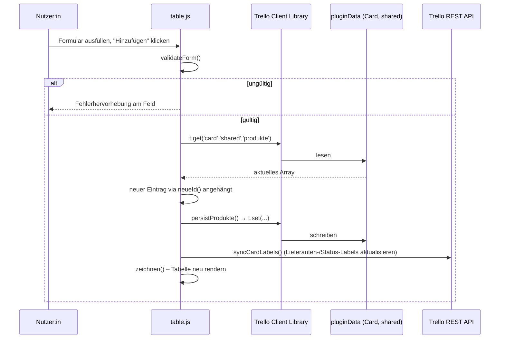
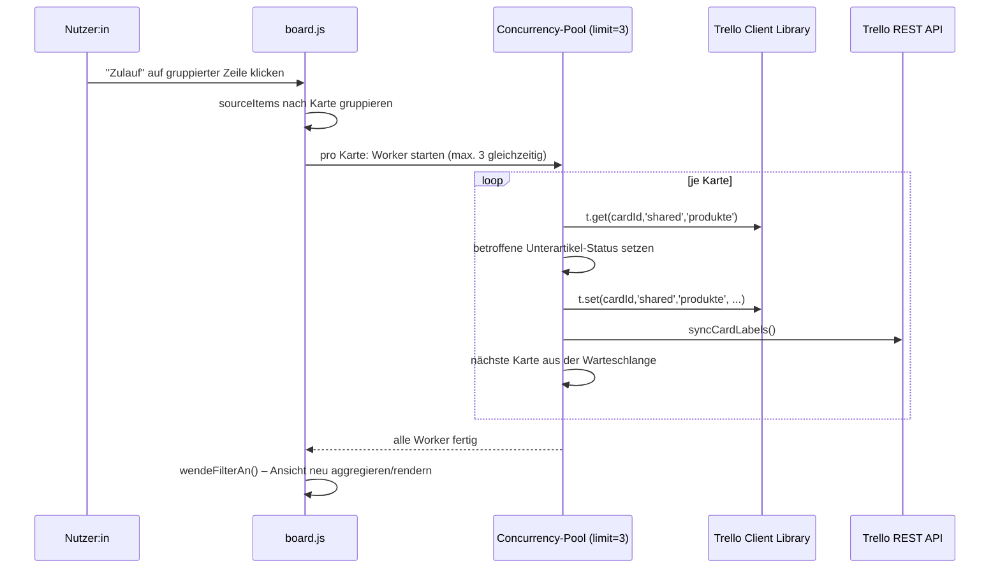

# Technische Dokumentation
## Blumenladen Produktliste – Trello Power-Up

| | |
|---|---|
| **Projekt** | Blumenladen Produktliste |
| **Typ** | Trello Power-Up (Client-seitige Web-Anwendung) |
| **Power-Up-ID** | `6a676afc7478af31281fff48` |
| **Hosting** | `https://renner-trello.de.cool/` |
| **Autor** | Basti |
| **Dokumentstatus** | Aktueller Codestand (Stand: nach 3 Review-/Fix-Iterationen) |
| **Zielgruppe** | Entwickler:innen, die das Projekt warten oder erweitern |

---

## 1. Überblick

### 1.1 Zweck

Das Power-Up erweitert Trello um eine strukturierte Erfassung und Auswertung von Bestellungen für den Blumenladenbetrieb der Firma Renner. Auf jeder Trello-Karte (= eine Bestellung/ein Kunde) können Mitarbeitende:

- **Hauptartikel** (z. B. "Trauerkranz") mit Stückzahl und Verkaufspreis erfassen,
- diesen **Unterartikel** (Material/Zutaten, z. B. "Rose Rot") mit Lieferant und Bestellstatus zuordnen,
- den Bestellstatus (*Zu bestellen* / *Im Zulauf* / *Vorhanden*) pflegen.

Board-weit stehen zusätzlich zur Verfügung:

- eine **Katalogverwaltung** (wiederverwendbare Produkt-/Materialvorlagen inkl. Schnellauswahl-Buttons),
- eine **Auswertungs- und Bestell-Manager-Ansicht** über alle Karten eines Boards hinweg (Filterung, Gruppierung, CSV-Export, Text-Export für Lieferantenbestellungen),
- eine **Lieferanten-/Label-Konfiguration**, die automatisch Trello-Labels auf Karten setzt, sobald offene Bestellungen bei einem Lieferanten vorliegen.

### 1.2 Technologie-Stack

| Ebene | Technologie |
|---|---|
| Laufzeitumgebung | Browser-Iframe innerhalb von Trello (kein eigener Server-Prozess) |
| Sprache | Vanilla JavaScript (ES6+), kein Build-Step, kein Framework |
| Trello-Integration | [Trello Power-Up Client Library](https://developer.atlassian.com/cloud/trello/power-ups/) (`power-up.min.js`), Trello REST API v1 |
| Persistenz | Trello **pluginData** (Card-Scope `shared` und Board-Scope `shared`) – es gibt **keine eigene Datenbank** |
| Styling | Statisches CSS (`hell.css`, `dunkel.css`), Theme-Umschaltung über `data-theme`-Attribut |
| Hosting | Statisches File-Hosting unter `renner-trello.de.cool` (kein Server-Backend) |

**Wichtige Architektur-Konsequenz:** Da keine eigene Datenbank existiert, ist Trello selbst die "Source of Truth". Sämtliche Anwendungsdaten (Artikel, Katalog, Lieferanten) werden als JSON in Trello-pluginData-Feldern gespeichert und bei jedem Öffnen einer View live über die Power-Up-API bzw. die Trello-REST-API geladen.

### 1.3 Nicht-Ziele

- Keine serverseitige Logik, keine eigene Authentifizierung (nutzt Trellos OAuth-Fluss).
- Kein automatisiertes Test-Setup (siehe [Abschnitt 11](#11-bekannte-einschränkungen--technische-schulden)).
- Kein Build-/Bundling-Prozess – alle Dateien werden 1:1 ausgeliefert.

---

## 2. Systemarchitektur

### 2.1 Grobarchitektur



### 2.2 Betriebsmodi der Power-Up-Oberflächen

| Datei-Paar | Trello-Capability / Aufrufkontext | Scope der Daten |
|---|---|---|
| `index.html` / `client.js` | Connector-Iframe, registriert alle Capabilities (`card-badges`, `card-back-section`, `board-buttons`, `show-settings`, `authorization-status`, `show-authorization`) | – |
| `table.html` / `table.js` | `card-back-section` – eingebettet auf jeder Kartenrückseite | **Card-Scope**, `shared` |
| `menu.html` / `menu.js` | Popup über den Board-Button "Auswertung" | – (nur Navigation) |
| `katalog.html` / `katalog.js` | Modal, aus dem Menü geöffnet | **Board-Scope**, `shared` |
| `board.html` / `board.js` | Modal, aus dem Menü geöffnet | **Board-Scope**, `shared` (Katalog/Lieferanten) + **Card-Scope** aller Karten (Bulk-Lesen via REST) |
| `settings.html` / `settings.js` | Popup über Power-Up-Einstellungen (`show-settings`) | **Board-Scope**, `shared` |
| `auth.html` / `auth.js` | Popup über `show-authorization` (erscheint automatisch, wenn REST-API-Zugriff fehlt) | – |

### 2.3 Modul-/Namespace-Architektur

Alle interaktiven Skripte (`table.js`, `katalog.js`, `board.js`) sind in eine **IIFE** (`(function() { ... })()`) gekapselt, um globale Namensraum-Verschmutzung zu vermeiden. Interaktionen erfolgen konsequent über **Event-Delegation** mit `data-action`-Attributen statt über inline `onclick`-Handler – dies ist zugleich eine Sicherheitsmaßnahme (siehe [Abschnitt 6.1](#61-xss-schutz)).

`utils.js` ist bewusst **nicht** gekapselt: Es definiert globale Funktionen/Konstanten, die von allen anderen Skripten als gemeinsame Bibliothek genutzt werden (klassisches "Utility-Script"-Pattern ohne Modul-Bundler).

---

## 3. Verzeichnis- und Dateistruktur

```
/
├── index.html            Connector-Iframe (lädt client.js)
├── client.js              Registrierung aller Power-Up-Capabilities
├── manifest.json           Power-Up-Manifest (Capabilities, Icons, Connector-URL)
├── config.js               Secrets (App-Key, Power-Up-ID, Base-URL) – NICHT in Versionskontrolle
├── config.example.js       Vorlage für config.js (für GitHub/Onboarding)
│
├── utils.js                Zentrale Utility-Bibliothek (siehe Abschnitt 5.8)
│
├── table.html / table.js   Kartenrückseite: Artikel-/Unterartikel-Erfassung
├── katalog.html / katalog.js  Katalog-Verwaltung (Produkt-/Materialvorlagen)
├── board.html / board.js   Board-weite Auswertung & Bestell-Manager
├── settings.html / settings.js  Lieferanten- & Label-Konfiguration
├── menu.html / menu.js     Einstiegs-Popup (Navigation zu Katalog/Auswertung)
├── auth.html / auth.js     OAuth-Autorisierungs-Popup
│
├── hell.css                 Basis-Stylesheet (Light-Theme, Layout, Komponenten)
└── dunkel.css                Dark-Theme-Overrides (via [data-theme="dark"])
```

**Namenskonvention:** Deutsche Begriffe für fachliche/Domänen-Funktionen und -Variablen (`produkte`, `unterartikel`, `zeichnen`, `speichern`), englische Begriffe für generische technische Utilities (`escapeHtml`, `handleError`, `showToast`). Diese Konvention ist projektweit konsistent eingehalten.

---

## 4. Datenmodell

Da keine eigene Datenbank existiert, ist das Datenmodell vollständig durch die Struktur der in Trello **pluginData** gespeicherten JSON-Objekte definiert.

### 4.1 Card-Scope: `produkte`

Gespeichert unter `t.get('card', 'shared', 'produkte')` bzw. `t.set('card', 'shared', 'produkte', ...)`. Pro Karte existiert **ein** Array von Hauptartikeln.

```jsonc
[
  {
    "id": "kx3f9a2b-...",          // via crypto.randomUUID() erzeugt
    "stk": "3",                    // Stückzahl (String, ganzzahlig)
    "produkt": "Trauerkranz",      // Artikelname
    "preis": "45.00",              // Verkaufspreis pro Stück, Punkt-Dezimaltrennzeichen
    "lieferant": "",               // aktuell bei Hauptartikeln stets leer (siehe 4.4)
    "unterartikel": [
      {
        "id": "m8k2p1qz-...",
        "stk": "12",
        "produkt": "Rose Rot",
        "preis": "1.20",
        "status": "bestellen",     // "bestellen" | "zulauf" | "vorhanden"
        "lieferant": "lief_1699999999123"   // Referenz auf Lieferanten-ID
      }
    ]
  }
]
```

Auf Trello-Ebene wird dieses Array serverseitig als `pluginData`-Eintrag mit `idPlugin = POWERUP_ID` und `value = JSON.stringify({ produkte: [...] })` abgelegt (Konvention der Power-Up Client Library für einzelne `t.set(cardId, 'shared', 'produkte', ...)`-Aufrufe).

### 4.2 Board-Scope: Katalog

```jsonc
// t.get('board', 'shared', 'katalogProdukte')
[
  { "name": "Trauerkranz", "preis": "45.00", "lieferant": "", "isQuickButton": true }
]

// t.get('board', 'shared', 'katalogMaterial')
[
  { "name": "Rose Rot", "preis": "1.20", "lieferant": "lief_1699999999123" }
]
```

`isQuickButton` markiert Einträge, die als Schnellauswahl-Button im Hauptartikel-Formular (`table.html`) erscheinen (max. 6 gleichzeitig, siehe `quickCount`-Logik in `katalog.js`).

**Legacy-Feld** `t.get('board', 'shared', 'katalog')`: Altes, unstrukturiertes Katalog-Array vor der Trennung in Produkte/Material. Wird beim ersten Laden von `katalog.js` einmalig migriert (Einträge mit gesetztem `lieferant` → `katalogMaterial`, alle anderen → `katalogProdukte`) und danach nicht mehr geschrieben.

### 4.3 Board-Scope: Lieferanten & Labels

```jsonc
// t.get('board', 'shared', 'lieferanten')
[
  { "id": "lief_1699999999123", "name": "Volmary", "labelId": "64f1a2b3c4d5e6..." }
]

// t.get('board', 'shared', 'statusLabels')
{ "allesBestellt": "64f1a2b3c4d5e6..." }   // Label-ID, das gesetzt wird, wenn alle offenen
                                             // Unterartikel im Status "zulauf" sind
```

**Legacy-Format:** Vor der Umstellung auf ein Array wurden Lieferanten als Objekt `{ lief1: {name, labelId}, lief2: {name, labelId} }` (max. 2 Lieferanten) gespeichert. `normalizeLieferantenEinstellungen()` in `utils.js` erkennt und konvertiert beide Formate transparent (siehe 5.8) – eine explizite Migrationsschreibung in das neue Format findet aktuell **nicht** statt, die Normalisierung erfolgt bei jedem Lesevorgang neu.

### 4.4 Datenmodell-Hinweis: `lieferant`-Feld bei Hauptartikeln

Das Datenmodell sieht ein `lieferant`-Feld sowohl bei Haupt- als auch bei Unterartikeln vor. In der aktuellen UI (`katalog.html`, Tab "Produkte") wird dieses Feld bei Hauptartikeln jedoch nie gesetzt – Lieferanten werden ausschließlich auf Unterartikel-Ebene gepflegt. Die effektive Lieferanten-Zuordnung eines Unterartikels ergibt sich aus:

```js
// utils.js
function getEffectiveLieferant(sub, haupt) {
  return sub.lieferant || haupt.lieferant;
}
```

Das `lieferant`-Feld am Hauptartikel bleibt damit ein für zukünftige Erweiterungen vorbereitetes, aktuell ungenutztes Fallback.

---

## 5. Komponentenreferenz

### 5.1 `manifest.json`

Deklaratives Power-Up-Manifest gemäß Trello-Spezifikation. Definiert die genutzten Capabilities und die Connector-URL (`index.html`). Icons werden extern referenziert.

### 5.2 `config.js` / `config.example.js`

```js
const CONFIG = {
    TRELLO_APP_KEY: '...',   // Trello API-Key des Power-Ups
    POWERUP_ID: '...',       // Power-Up-ID (= idPlugin für pluginData-Filterung)
    BASE_URL: 'https://renner-trello.de.cool/'
};
```

`config.js` enthält Secrets und ist **nicht** Teil der Versionskontrolle; `config.example.js` dient als Vorlage/Dokumentation für neue Deployments. Alle HTML-Einstiegspunkte laden `config.js` vor allen übrigen Skripten.

> ⚠️ Der `TRELLO_APP_KEY` ist per Design öffentlich (er identifiziert das Power-Up, ist aber kein Geheimnis im engeren Sinn – vergleichbar einer Client-ID bei OAuth). Sicherheitsrelevant sind ausschließlich die pro Nutzer:in ausgestellten REST-API-Tokens, die niemals im Code hinterlegt, sondern zur Laufzeit über `t.getRestApi().authorize()` erzeugt werden.

### 5.3 `client.js`

Einstiegspunkt, der `TrelloPowerUp.initialize()` mit den Capability-Handlern aufruft:

| Capability | Verhalten |
|---|---|
| `board-buttons` | Öffnet `menu.html` als Popup |
| `card-badges` | Liest `produkte` (Card-Scope) und zeigt pro Hauptartikel ein Badge `"3x Trauerkranz – 45,00€"` |
| `card-back-section` | Bettet `table.html` als iframe in die Kartenrückseite ein (`t.signUrl()` zur signierten URL-Übergabe) |
| `show-settings` | Öffnet `settings.html` als Popup |
| `authorization-status` | Meldet Trello, ob ein gültiges REST-API-Token vorliegt |
| `show-authorization` | Öffnet `auth.html` als Popup (wird von Trello automatisch aufgerufen, wenn `authorization-status: false`) |

### 5.4 `table.js` / `table.html` – Kartenrückseite

**Verantwortlichkeit:** CRUD für Hauptartikel und deren Unterartikel auf einer einzelnen Karte.

Zentrale Funktionen:

| Funktion | Zweck |
|---|---|
| `zeichnen()` | Rendert die komplette Artikeltabelle aus `produkte` (Card-Scope) neu; nutzt `DocumentFragment` + `replaceChildren()` zum Ersetzen des Tabelleninhalts |
| `validateForm(stkEl, artEl, preisEl)` | Gemeinsame Validierung für Haupt- und Unterartikel-Formular (Pflichtfeld, Ganzzahl-Regex für Stückzahl, Komma-/Punkt-tolerante Preis-Parsung) |
| `openOverlay(type, mainId)` / `closeOverlays()` | Steuert die beiden Modal-Overlays (Hauptartikel, Unterartikel) |
| `editItem(type, mainId, subId)` | Befüllt ein Overlay im Bearbeiten-Modus |
| `attachAutoFill(inputId, preisId, liefId)` | Automatisches Vorausfüllen von Preis (und ggf. Lieferant) beim Tippen eines im Katalog bekannten Artikelnamens |
| `neueId()` | Erzeugt eindeutige IDs via `crypto.randomUUID()` (Fallback: Zeitstempel + Zufallsstring) |
| Tastatur-Shortcuts | `+` öffnet Hauptartikel-Overlay, `n`/`N` öffnet Unterartikel-Overlay für den zuletzt bearbeiteten Hauptartikel, `Esc` schließt Overlays, `Enter` in Formularfeldern löst Speichern aus |

Alle datenverändernden Operationen (`speichern`, `addSub`, `updateRadio`, `loeschen`, `loeschenSub`) folgen dem Muster:

```
t.get('card', 'shared', 'produkte', [])
  → lokale Mutation des Arrays
  → persistProdukte(t, cardId, produkte)   // utils.js: t.set(...) + syncCardLabels(...)
  → zeichnen()
```

### 5.5 `katalog.js` / `katalog.html` – Katalogverwaltung

**Verantwortlichkeit:** Board-weite Pflege der Vorlagenlisten für Hauptartikel ("Produkte") und Unterartikel ("Material") in einer Zwei-Tab-Ansicht mit Inline-Bearbeitung.

Zentrale Funktionen:

| Funktion | Zweck |
|---|---|
| `zeichnen()` | Rendert die aktive Tab-Tabelle inkl. Inline-Edit-Zeile; setzt danach `t.sizeTo()` und fokussiert bei Bedarf das neu bearbeitete Feld |
| `speichernInline(index)` | Validiert und speichert eine Inline-Zeile; prüft Namens-Eindeutigkeit innerhalb des aktiven Tabs; per `isSavingInline`-Flag gegen Doppel-Submit abgesichert |
| `toggleQuickBtn(index, checked)` | Markiert/entmarkiert einen Produkt-Eintrag als Schnellauswahl-Button (max. 6 aktive gleichzeitig) |
| Migrationslogik (in `t.render`) | Einmalige Konvertierung des Legacy-`katalog`-Arrays in `katalogProdukte`/`katalogMaterial` beim ersten Laden nach dem Rollout |

### 5.6 `board.js` / `board.html` – Auswertung & Bestell-Manager

**Verantwortlichkeit:** Board-weite Aggregation aller Karten-Artikel in zwei Ansichten:

1. **Auswertung** – Summierte Stückzahlen/Umsätze je Artikel, gruppierbar nach Karte und/oder übergeordnetem Hauptartikel, mit CSV- und Druck-Export.
2. **Bestell-Manager** – Liste aller offenen Unterartikel (Status `bestellen`/`zulauf`), mit Direktaktionen zum Statuswechsel (einzeln oder gruppiert über mehrere Karten hinweg) sowie Text-Export für Lieferantenbestellungen.

Architektur (bewusst in reine und unreine Funktionsteile getrennt, siehe [Abschnitt 8](#8-testbarkeit)):

```
getFilterOptionsFromDOM()   → liest Filterzustand aus dem DOM         (unrein)
filterCards(cards, options) → reine Filterfunktion auf Kartenebene    (rein)
aggregateProductSums(...)   → reine Aggregation/Gruppierung           (rein)
zeichneAuswertung(...) / zeichneManager(...) → reines Rendering       (unrein, nur DOM-Schreiben)
```

Datenbeschaffung erfolgt **nicht** über die Power-Up Client Library (die nur Zugriff auf die aktuelle Karte/das aktuelle Board erlaubt), sondern per **Trello REST API** (`GET /1/boards/{id}/cards?pluginData=true`), da alle Karten samt pluginData in einem Rutsch benötigt werden. Authentifizierung erfolgt über den vom Nutzer autorisierten REST-Token (`t.getRestApi().getToken()`), übermittelt per `Authorization`-Header (siehe [Abschnitt 6.2](#62-authentifizierung)).

Statusänderungen für einzelne Karten laufen über `updateBestellStatus()`, für mehrere Karten gleichzeitig über `updateMehrereBestellStatus()` mit einem **Concurrency-Pool** (max. 3 parallele Requests) zur Vermeidung von Trello-API-Rate-Limits.

### 5.7 `settings.js` / `settings.html`

**Verantwortlichkeit:** Pflege der Lieferantenliste (Name + zugeordnetes Trello-Label) sowie des "Alles bestellt"-Sonder-Labels. Persistiert nach `board/shared/lieferanten` bzw. `board/shared/statusLabels`.

### 5.8 `auth.js` / `auth.html`

**Verantwortlichkeit:** Startet den Trello-OAuth-Fluss (`t.getRestApi().authorize({ scope: 'read,write', expiration: 'never' })`). Wird von Trello automatisch angezeigt, sobald `authorization-status` `false` zurückliefert (z. B. beim ersten Öffnen des Bestell-Managers).

### 5.9 `utils.js` – Zentrale Utility-Bibliothek

Von **allen** anderen Skripten eingebunden. Enthält keine DOM-Rendering-Logik, sondern ausschließlich wiederverwendbare, größtenteils reine Funktionen:

| Funktion | Signatur | Zweck |
|---|---|---|
| `escapeHtml` | `(str) => string` | Escaped `&`, `<`, `>` für sichere Verwendung als HTML-**Textinhalt** |
| `escapeHtmlAttr` | `(str) => string` | Wie `escapeHtml`, zusätzlich `"` und `'` – für sichere Verwendung in HTML-**Attributen** |
| `formatEuro` | `(n) => string` | Formatiert eine Zahl als `"12,34 €"` |
| `parsePreisToCents` | `(pStr) => number` | Robuste Preis-Parsung (erkennt Komma vs. Punkt als Dezimaltrennzeichen anhand der Position), liefert Ganzzahl-Cent-Betrag zur Vermeidung von Float-Rundungsfehlern |
| `normalizeLieferantenEinstellungen` | `(data) => Array` | Konvertiert Legacy-Objekt-Format (`{lief1, lief2}`) und aktuelles Array-Format einheitlich in ein Array |
| `getLieferantName` | `(liefKey, settingsArray) => string` | Löst eine Lieferanten-ID zu einem Anzeigenamen auf |
| `getEffectiveLieferant` | `(sub, haupt) => string` | Ermittelt den wirksamen Lieferanten eines Unterartikels (siehe 4.4) |
| `apiFetch` | `(url, options, appKey, token) => Promise<json>` | Wrapper um `fetch()` mit `Authorization: OAuth`-Header; wirft bei HTTP 429 gezielt `Error('RateLimit')` |
| `syncCardLabels` | `(t, cardId, produkte) => Promise` | Berechnet den Soll-Zustand der Lieferanten-/Status-Labels einer Karte und gleicht ihn per REST-API ab |
| `persistProdukte` | `(t, cardId, produkte) => Promise` | Kombiniert `t.set('card', 'shared', 'produkte', ...)` mit `syncCardLabels(...)` |
| `showToast` | `(message, isError) => void` | Nicht-blockierende Toast-Benachrichtigung (ersetzt `alert()`) |
| `handleError` | `(err) => void` | Standard-Fehlerbehandlung: Logging via `console.error` + `showToast` |
| `STANDARD_KATALOG` | Konstante | Vorbelegter Standard-Materialkatalog für neue Boards |

---

## 6. Sicherheitskonzept

### 6.1 XSS-Schutz

Da alle Artikel-, Katalog- und Lieferantennamen von Mitarbeitenden frei eingegeben werden und anschließend als HTML gerendert werden, gilt konsequent:

- **Textinhalte** werden mit `escapeHtml()` escaped.
- **HTML-Attributwerte** (z. B. `value="..."`, `data-id="..."`) werden mit `escapeHtmlAttr()` escaped, das zusätzlich `"` und `'` kodiert.
- Es werden **keine** dynamischen `onclick="..."`-Strings mehr aus Nutzereingaben zusammengesetzt. Stattdessen: statische `data-action`/`data-id`-Attribute + zentrale `addEventListener`-Delegation pro Container. Dadurch entfällt die Angriffsfläche für Attribut- und Event-Handler-Injection strukturell, unabhängig von der Escaping-Korrektheit im Einzelfall.

### 6.2 Authentifizierung

- **Power-Up-eigene Daten** (`t.get`/`t.set`) laufen über die von Trello bereitgestellte, sandboxed Iframe-Bridge – kein direkter API-Zugriff, keine eigene Authentifizierung nötig.
- **Trello-REST-API-Zugriffe** (Bulk-Kartenabruf im Board-Manager, Label-Synchronisation) erfordern ein vom Nutzer autorisiertes OAuth-Token (`expiration: 'never'`). Das Token wird **nicht** als URL-Query-Parameter übertragen, sondern per `Authorization: OAuth oauth_consumer_key="...", oauth_token="..."`-Header (siehe `apiFetch()` in `utils.js`), um eine Exposition über Browser-Historie/Netzwerklogs zu vermeiden.

### 6.3 CSV-Injection-Schutz

Der CSV-Export (`csvFeld()` in `board.js`) neutralisiert Formel-Injection-Vektoren (`=`, `+`, `-`, `@` am Feldanfang) durch Voranstellen eines `'`-Zeichens (Excel-Standardkonvention) und quotet Felder mit Sonderzeichen (`;`, `"`, Zeilenumbrüchen) gemäß RFC 4180.

### 6.4 Rate-Limiting / Missbrauchsschutz

- `inFlightRequests`-Set verhindert parallele, sich überschneidende Schreibzugriffe auf dieselbe Karte innerhalb derselben Browser-Session.
- Bulk-Statusänderungen über mehrere Karten laufen über einen Concurrency-Pool (max. 3 parallele Requests), um Trellos API-Rate-Limits nicht zu verletzen.
- HTTP 429-Antworten werden von `apiFetch()` erkannt und im Label-Sync-Pfad bewusst weich abgefangen (Log statt Fehleranzeige), da ein fehlgeschlagener Label-Sync die eigentliche Datenspeicherung nicht gefährdet.

### 6.5 Bekannte Restrisiken

- **Keine Optimistic-Concurrency-Control:** Bei zeitgleicher Bearbeitung derselben Karte durch zwei Nutzer:innen (z. B. eine Person auf der Kartenrückseite, eine andere im Bestell-Manager) gilt "last write wins" – es findet keine Konflikterkennung statt.
- **Kein Pagination-Handling** beim Bulk-Laden aller Karten im Auswertungs-Modul; bei sehr großen Boards potenziell relevant für Antwortgröße/-zeit.

---

## 7. Fehlerbehandlung & Logging

| Ebene | Verhalten |
|---|---|
| Erwartete Validierungsfehler (leeres Pflichtfeld, ungültiger Preis) | Visuelles Feedback direkt am Formularfeld (`error-blink`-Animation + Fokus), kein Toast |
| Unerwartete Fehler bei Trello-API-Aufrufen | `handleError()`: `console.error()` (vollständiger Fehler für Entwickler-Diagnose) + `showToast()` (generische, nutzerfreundliche Meldung ohne technische Details) |
| Netzwerkfehler beim Bulk-Laden der Karten (`ladeAuswertung`) | Eigener `console.error`-Log + Statuszeile "Fehler beim Laden der API." im UI |
| Rate-Limit (HTTP 429) beim Label-Sync | Bewusst als Warnung (`console.warn`), nicht als Nutzerfehler behandelt – Kernfunktion (Artikelspeicherung) ist davon nicht betroffen |
| Fehlgeschlagene Einzel-Statusänderung im Manager | Button zeigt temporär "Fehler" an, kehrt nach 3 Sekunden zum Ursprungszustand zurück |

**Prinzip:** Nutzer:innen erhalten niemals rohe Fehlermeldungen/Stacktraces (Informationsleck-Vermeidung), Entwickler:innen erhalten über die Browser-Konsole die vollständige Fehlerinformation.

---

## 8. Testbarkeit

Das Projekt verfügt aktuell über **keine automatisierten Tests**. Die Architektur wurde jedoch gezielt so ausgerichtet, dass reine, DOM-unabhängige Funktionen isoliert unit-testbar wären, u. a.:

- `parsePreisToCents`, `formatEuro`, `escapeHtml`, `escapeHtmlAttr`, `normalizeLieferantenEinstellungen`, `getEffectiveLieferant` (alle in `utils.js`)
- `filterCards(cards, options)` und `aggregateProductSums(cards, options)` (in `board.js`) – nehmen Daten und Optionen als Parameter entgegen und liefern reine Datenstrukturen zurück, ohne selbst auf `document` zuzugreifen.

Für ein zukünftiges Test-Setup eignet sich ein leichtgewichtiges Framework ohne Build-Step (z. B. Node-natives `node:test` oder Vitest gegen extrahierte Utility-Module), da das Projekt bewusst ohne Bundler auskommt.

---

## 9. Konfiguration & Deployment

### 9.1 Voraussetzungen

- Statisches HTTPS-Hosting (Trello lädt Power-Up-Ressourcen ausschließlich über HTTPS).
- Ein bei Trello registrierter Power-Up mit App-Key und Power-Up-ID (siehe [Trello Power-Up Admin Portal](https://trello.com/power-ups/admin)).

### 9.2 Ersteinrichtung

1. `config.example.js` nach `config.js` kopieren und mit den tatsächlichen Werten (`TRELLO_APP_KEY`, `POWERUP_ID`, `BASE_URL`) befüllen.
2. `config.js` **nicht** in die Versionskontrolle aufnehmen (`.gitignore`).
3. Alle Dateien unverändert auf den in `manifest.json` / `CONFIG.BASE_URL` hinterlegten Host hochladen.
4. Power-Up im Trello Admin Portal mit der Connector-URL (`.../index.html`) und den in `manifest.json` gelisteten Capabilities registrieren.
5. Cache-Busting: Skript-Referenzen nutzen Query-Parameter (`?v=4`) zur gezielten Invalidierung des Browser-Caches bei Deployments – dieser Wert muss bei größeren Änderungen inkrementiert werden.

### 9.3 Konfigurationsoberflächen im Betrieb

Nach der Ersteinrichtung erfolgt die fachliche Konfiguration vollständig über die Power-Up-UI selbst, keine erneute Code-Änderung nötig:

- **Katalog** (Produkte/Material, Schnellauswahl-Buttons) → Menü → "Katalog bearbeiten"
- **Lieferanten & Labels** → Power-Up-Einstellungen → "Einstellungen"

---

## 10. Datenflüsse (Sequenzdiagramme)

### 10.1 Hauptartikel auf einer Karte speichern



### 10.2 Bestellstatus für mehrere Karten im Manager ändern



---

## 11. Bekannte Einschränkungen / technische Schulden

| Punkt | Beschreibung | Einordnung |
|---|---|---|
| Keine Konflikterkennung bei Nebenläufigkeit | "Last write wins" bei zeitgleicher Bearbeitung derselben Karte | Architektonisch, größerer Aufwand |
| Kein Pagination-Handling | `ladeAuswertung()` lädt alle Board-Karten in einem Request | Relevant erst bei sehr großen Boards |
| Kein automatisiertes Testing | Keine Unit-/Integrationstests vorhanden | Infrastruktur fehlt, Code ist aber testbar vorbereitet |
| Kleinere Restduplikation | `validateForm()` in `table.js` reimplementiert die Preis-Parsing-Logik statt `parsePreisToCents()` direkt zu nutzen | Kosmetisch |
| Vereinzelte inline Event-Handler | `sub-lieferant`-Select in `table.html` nutzt weiterhin `onchange="..."` (statischer, nicht nutzergenerierter Code) | Kosmetisch, kein Sicherheitsrisiko |

---

## 12. Erweiterungsmöglichkeiten (Roadmap-Vorschläge)

- Optimistic-Concurrency-Control (z. B. Versions-/Zeitstempel-Feld je `produkte`-Array) zur Vermeidung von Lost Updates.
- Server-seitige oder gecachte Aggregation für Boards mit sehr vielen Karten, um wiederholte Voll-Ladevorgänge im Auswertungsmodul zu vermeiden.
- Automatisiertes Test-Setup für die bereits als reine Funktionen ausgelagerte Business-Logik (`utils.js`, `filterCards`, `aggregateProductSums`).
- Migration des Legacy-Lieferanten-Objektformats (`lief1`/`lief2`) in das aktuelle Array-Format als einmaliger Schreibvorgang, um `normalizeLieferantenEinstellungen()` langfristig entfernen zu können.

---

## 13. Änderungshistorie (Auszug)

Diese Dokumentation spiegelt den Stand nach mehreren Überarbeitungsrunden wider. Wesentliche Meilensteine:

- **Sicherheitshärtung:** Einführung von `escapeHtmlAttr()`, vollständige Umstellung von inline `onclick`-Strings auf `data-action`-basierte Event-Delegation in allen drei interaktiven Modulen (`table.js`, `katalog.js`, `board.js`), Umstellung der Trello-REST-Authentifizierung von URL-Query-Parametern auf `Authorization`-Header.
- **Konsolidierung:** Zusammenführung mehrfach dupliziert vorliegender Funktionen (`getLieferantName`, `normalizeLieferantenEinstellungen`, `parsePreisToCents`, Preis-Formatierung) in `utils.js` als einzige Quelle der Wahrheit.
- **Robustheit:** Ganzzahl-Cent-basierte Preisberechnung zur Vermeidung von Float-Rundungsfehlern; verbesserte Preis-Parsung (Komma-/Punkt-Erkennung); Concurrency-Pool für Bulk-Statusänderungen zur Rate-Limit-Vermeidung; nicht-blockierende Toast-Benachrichtigungen anstelle von `alert()`.
- **Testbarkeit:** Aufspaltung der Board-Auswertungslogik in reine Funktionen (`getFilterOptionsFromDOM`, `filterCards`, `aggregateProductSums`) getrennt vom DOM-Rendering.

---

## 14. Glossar

| Begriff | Bedeutung |
|---|---|
| **Hauptartikel** | Ein verkaufter Blumenladen-Artikel (z. B. Trauerkranz) auf einer Karte |
| **Unterartikel** | Ein einem Hauptartikel zugeordnetes Material/Bestandteil (z. B. Rose Rot) mit eigenem Bestellstatus |
| **Katalog** | Board-weite, wiederverwendbare Vorlagenliste für Haupt-/Unterartikel |
| **Bestell-Manager** | Board-weite Übersicht aller offenen (nicht "vorhanden") Unterartikel mit Sammelaktionen |
| **pluginData** | Trellos generischer Key-Value-Speichermechanismus für Power-Ups, verfügbar in den Scopes *card*/*board* × *private*/*shared* |
| **Card-Scope** | Daten, die an eine einzelne Trello-Karte gebunden sind |
| **Board-Scope** | Daten, die für alle Karten eines Boards gemeinsam gelten |
